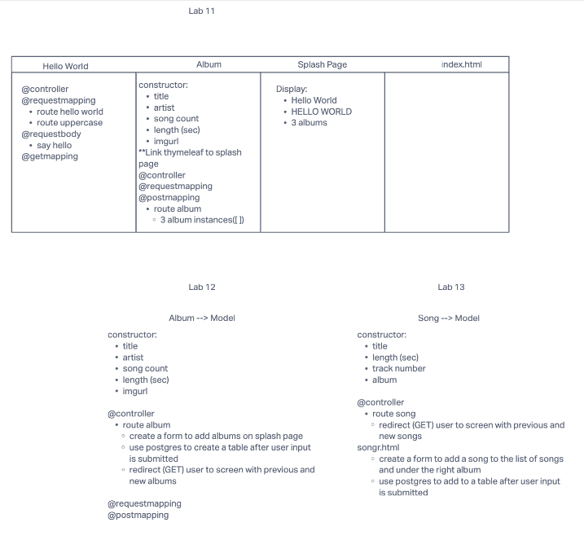

# Lab Summary
In this lab, we were supposed to crete an app that would initial display hardcoded album object. As the week progressed we refactored the code to take user input and display an album object and save to a database. Finally, a song object was added. Again, taking user input, saving it to a database, and displaying it under the album it belongs to. The databases are autowired to link the songs with the album.

## Whiteboard Process

## Approach & Efficiency
I attempted to approach this project in a systematic manner. I began by domain modeling the problem domain for each lab. I then, followed the framework I outlined, in an effort to maximize my time. I began to run in to problems when I didn't have the correct code for my dependencies nor my application properties file. Once I corrected that I was able to move forward with the project. I got stuck again when I began working in the song controller. I have successfully saved data to the database, but I still have not been able to display the data, nor match the song with the album.
## Solution
When I enter the album information in the form within the app, it displays on the screen and it saves to the database. When I enter song information, it saves to the database, but does not display. I have not been able to debug that piece of code.  I have tried for two days, with help, and still can't get passed it.
